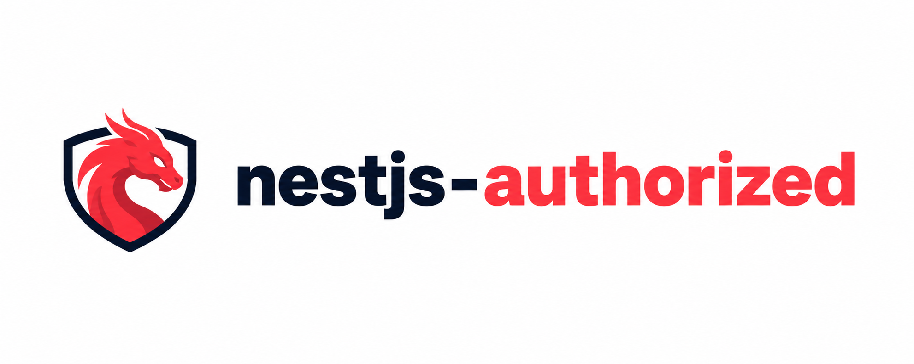

<p align="center">
  
</p>

# nestjs-authorized

JWT 2.0 authorization module for NestJS with separate access and refresh token flows, stateless refresh tokens, and a small integration surface.

## Badges

[](https://nestjs.com/)
[](https://www.typescriptlang.org/)
[](https://nodejs.org/)
[](LICENSE.md)
[](docs/api.md)

## Features

- Stateless refresh token flow with separate secrets and expirations for access and refresh tokens
- `AuthModule.forRoot(...)` setup for quick NestJS integration
- Optional bundled `AuthController` for `login`, `refresh`, and `me` endpoints
- Exported guards, strategies, DTOs, and interfaces for custom integrations
- Small public API that stays close to standard NestJS auth patterns

## Installation

Install the package and its peer dependencies in your NestJS application:

```bash
npm install nestjs-authorized @nestjs/jwt @nestjs/passport passport passport-jwt
```

The repository targets Node.js `22` via [`.nvmrc`](.nvmrc).

## Quick Start

```ts
import { Injectable, Module } from '@nestjs/common';
import { AuthController, AuthModule, type IUserService, type JwtModuleOptions } from 'nestjs-authorized';

@Injectable()
class UserService implements IUserService<any> {
  async validateUser({ email, username, password }: { email?: string; username?: string; password: string }) {
    return { id: 1, email, username, password };
  }

  async findById(id: string | number) {
    return { id };
  }

  async findByPayload(payload: any) {
    return { id: payload.sub, email: payload.email, username: payload.username };
  }
}

const jwtOptions: JwtModuleOptions = {
  accessTokenSecret: 'ACCESS_SECRET',
  accessTokenExpiresIn: '15m',
  refreshTokenSecret: 'REFRESH_SECRET',
  refreshTokenExpiresIn: '7d',
};

@Module({
  imports: [AuthModule.forRoot(jwtOptions, { provide: 'UserService', useClass: UserService })],
  providers: [UserService],
  controllers: [AuthController],
})
export class AppModule {}
```

If you use the bundled `AuthController`, register your provider under the `'UserService'` token. For a fuller walkthrough, see [docs/quick-start.md](docs/quick-start.md).

## Documentation

- [docs/README.md](docs/README.md) - documentation index
- [docs/quick-start.md](docs/quick-start.md) - setup, provider wiring, and built-in controller usage
- [docs/api.md](docs/api.md) - exported API, contracts, guards, strategies, and runtime notes

## Contributing

Contributions are welcome. See [CONTRIBUTING.md](CONTRIBUTING.md) for local setup, change expectations, and verification steps.

## License

[MIT](LICENSE.md)
